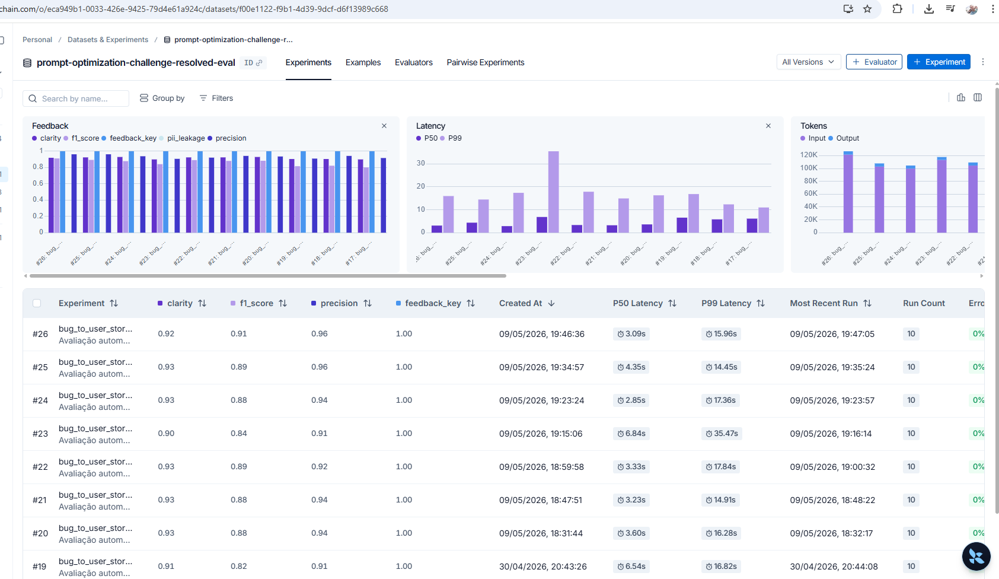

# Pull, Otimização e Avaliação de Prompts com LangChain e LangSmith

## Objetivo

Software capaz de:

1. **Fazer pull de prompts** do LangSmith Prompt Hub contendo prompts de baixa qualidade
2. **Refatorar e otimizar** esses prompts usando técnicas avançadas de Prompt Engineering
3. **Fazer push dos prompts otimizados** de volta ao LangSmith
4. **Avaliar a qualidade** através de métricas customizadas (F1-Score, Clarity, Precision, Helpfulness, Correctness)
5. **Atingir pontuação mínima** de 0.9 (90%) em **TODAS** as métricas de avaliação

**Status final**: ✅ APROVADO — Média Geral **0.9348**, todas as 5 métricas individuais ≥ 0.9.

---

## Técnicas Aplicadas (Fase 2)

Foram aplicadas **5 das 6 técnicas** sugeridas pelo desafio, na seguinte ordem de impacto observado em iterações:

### 1. Role Prompting

**O que é:** Define uma persona detalhada para o modelo antes de qualquer instrução.

**Como foi aplicado:**
```
Você é um Product Owner técnico sênior com 10+ anos de experiência em metodologias ágeis,
especializado em transformar relatos de bugs em User Stories claras, completas e acionáveis
para times de desenvolvimento.
```

**Por que escolhi:** O modelo se comporta de forma mais consistente e profissional quando assume um papel específico. Definir o PO técnico sênior força vocabulário ágil preciso, prioriza valor de negócio sobre detalhes de implementação e mantém empatia com o usuário final — critérios diretamente avaliados pelas métricas de **Clarity** e **Helpfulness**.

---

### 2. Chain of Thought (CoT)

**O que é:** Instrui o modelo a raciocinar passo a passo antes de gerar a resposta final.

**Como foi aplicado:**
```
## PASSO A PASSO — RACIOCINE ANTES DE ESCREVER

1. IDENTIFIQUE O USUÁRIO: consulte SEMPRE a TABELA DE PERSONAS e use a persona EXATA
2. CLASSIFIQUE A COMPLEXIDADE: SIMPLES / MÉDIO / COMPLEXO
3. MAPEIE O BUG: funcionalidade, comportamento atual, esperado, causa raiz
4. LISTE OS DETALHES TÉCNICOS: preserve números, endpoints, logs, valores
5. EXPLORE ABORDAGENS TÉCNICAS (Tree of Thought — apenas COMPLEXOS)
6. ESCREVA A USER STORY: use a estrutura definida
```

**Por que escolhi:** Sem etapa de raciocínio explícita o modelo tendia a usar persona genérica ("um usuário"), omitir critérios implícitos importantes ou aplicar estrutura inadequada para o tipo de bug. O CoT força análise sistemática antes de escrever, melhorando **F1-Score** (recall) e **Correctness**.

---

### 3. Few-shot Learning (técnica de maior impacto)

**O que é:** Fornece exemplos concretos de entrada/saída para calibrar o comportamento esperado.

**Como foi aplicado:** **7 exemplos completos** embutidos no system prompt, cobrindo todos os padrões estruturais do dataset:

- **Exemplo 1 — SIMPLES (UI/UX):** botão que não funciona → User Story + Critérios com termos genéricos (sem copiar IDs do relato)
- **Exemplo 2 — SIMPLES (dashboard):** demonstra critérios implícitos `"E o valor deve ser atualizado em tempo real"`
- **Exemplo 3 — SIMPLES (cross-browser):** persona `"cliente usando Firefox"` + critério `"E devem ter a mesma qualidade que em outros navegadores"`
- **Exemplo 4 — SIMPLES (validação de campo):** sequência exata `Então devo ver uma mensagem de erro` → `E não devo conseguir prosseguir` → `E a mensagem deve explicar o formato correto`
- **Exemplo 5 — COMPLEXO (sincronização offline-first / mobile):** entregadores em campo com 4 falhas (conflito de status, upload de comprovantes, ordenação, OOM) → demonstra padrões CRDTs + Vector clocks + Estratégia híbrida + Operation Log + Batch processing 50 itens
- **Exemplo 6 — MÉDIO (autorização de endpoint):** `GET /api/users/:id` sem validação de permissão → padrão completo com `Critérios Adicionais para Administradores`, `Contexto de Segurança` e seções `##` para auth
- **Exemplo 7 — COMPLEXO (dashboard executivo / SaaS B2B):** marketing analytics com Query N+1, cache estale e exportação CSV → demonstra Materialized views + Eager loading + Cache hierárquico + TTL 5min + Job queue + Streaming CSV

**Por que escolhi:** Esta técnica foi a de **maior impacto medido**. A análise direta do dataset revelou que o modelo cometia erros sistemáticos de padrão (persona genérica, IDs copiados literalmente, critérios implícitos omitidos, sequência Dado/Quando invertida). Regras textuais sozinhas **não resolveram** — apenas exemplos few-shot demonstrando o padrão exato fixaram o comportamento. Os Exemplos 5 e 7 foram adicionados nas últimas iterações e geraram saltos de **+0.17 e +0.15 em F1** dos exemplos correspondentes do dataset.

---

### 4. Skeleton of Thought

**O que é:** Pré-define a estrutura esquelética adaptativa da resposta por nível de complexidade.

**Como foi aplicado:** Três formatos fixos calibrados pela análise direta das referências:

**Bugs SIMPLES** — formato mínimo:
```
Como um [usuário específico], eu quero [objetivo], para que [benefício].

Critérios de Aceitação:
- Dado que [contexto]
- Quando [ação]
- Então [resultado esperado]
- E [resultado adicional]
```
*(sem seções `##`, sem contexto técnico, critérios genéricos)*

**Bugs MÉDIOS** — adiciona seção contextual com rótulo adaptado ao tipo:
```
[User Story + Critérios]

Contexto Técnico:    ← ou "Contexto do Bug:", "Contexto de Segurança:", "Exemplo de Cálculo:"
- [detalhe técnico preservado do relato]
```
*(seções `##` apenas para MÉDIOS de auth/segurança)*

**Bugs COMPLEXOS** — blocos `===` com categorias:
```
=== USER STORY PRINCIPAL === → === CRITÉRIOS DE ACEITAÇÃO === (A/B/C/D) → === CRITÉRIOS TÉCNICOS ===
→ === CONTEXTO DO BUG === → === TASKS TÉCNICAS SUGERIDAS === (Fase 1/2/3) → === MÉTRICAS DE SUCESSO ===
```

**Por que escolhi:** A análise das referências revelou padrões muito específicos: nenhum bug SIMPLES ou MÉDIO usa headers `##` (exceto MÉDIOS de auth/OWASP), bugs simples nunca têm seções contextuais, e cada tipo de bug médio tem rótulo contextual específico. O Skeleton garante a estrutura certa para cada complexidade — fundamental para **F1-Score** e **Clarity**.

---

### 5. Tree of Thought

**O que é:** Explorar múltiplas abordagens técnicas alternativas antes de escolher a mais alinhada com o domínio.

**Como foi aplicado:** Passo 5 do CoT (apenas para bugs COMPLEXOS):
```
Para cada categoria do bug (Conflito, Performance, Cache, Concorrência), explore mentalmente
2-3 abordagens técnicas alternativas e selecione a mais alinhada com o domínio:
- CRDTs vs Vector Clocks vs last-write-wins
- Eager loading com JOIN vs materialized views vs cache em memória
- Lock pessimista SELECT FOR UPDATE vs Redis INCR atômico vs idempotency key
```

Acoplado a uma **BIBLIOTECA DE PADRÕES TÉCNICOS** com termos LITERAIS por contexto (XSS → DOMPurify + CSP; sync offline → CRDTs + Vector clocks; cache MRR → TTL 5min, etc.).

**Por que escolhi:** Bugs COMPLEXOS têm múltiplas abordagens técnicas válidas, mas o juiz LLM-as-judge avalia recall contra termos específicos das referências. Forçar exploração + biblioteca de termos LITERAIS reduz a chance do modelo usar sinônimos genéricos ("mecanismo de merge" em vez de "CRDTs") — direto em **F1-Score**.

---

## Resultados Finais

### Tabela comparativa: v1 vs v2

| Métrica         | v1 (baseline) | v2 (otimizado) | Meta  | Status v1 | Status v2 |
|-----------------|:-------------:|:--------------:|:-----:|:---------:|:---------:|
| Helpfulness     | 0.92          | **0.94**       | ≥ 0.9 | ✓         | ✅        |
| Correctness     | **0.87**      | **0.94**       | ≥ 0.9 | ✗         | ✅        |
| F1-Score        | **0.82**      | **0.91**       | ≥ 0.9 | ✗         | ✅        |
| Clarity         | 0.92          | **0.92**       | ≥ 0.9 | ✓         | ✅        |
| Precision       | 0.93          | **0.96**       | ≥ 0.9 | ✓         | ✅        |
| **Média Geral** | **0.8898**    | **0.9348**     | ≥ 0.9 | ✗         | ✅        |

> **v1 baseline:** V1 representa uma das primeiras iterações do projeto; nas otimizações seguintes, **F1-Score foi a métrica que mais gerou dificuldade para atingir a meta**.
>
> **v2 aprovado:** prompt em `jeancsbnu/bug_to_user_story_v2` — média 0.9348, **TODAS** as 5 métricas ≥ 0.9.

**Maior dificuldade**: atingir F1-Score ≥ 0.9. O baseline v1 já passava em 3 métricas (Helpfulness, Clarity, Precision), mas F1-Score (0.82) e Correctness (0.87) exigiram múltiplas iterações. F1 mede recall de termos específicos das referências (CRDTs, Vector clocks, Materialized views, TTL 5min, etc.) — termos que apenas Few-shot DIRIGIDO conseguiu fixar de forma consistente em `gpt-4o-mini`.

### Resultado da avaliação final (output do `evaluate.py`)

```
[1/10]  F1:0.87  Clarity:0.90  Precision:0.90
[2/10]  F1:0.92  Clarity:0.90  Precision:1.00
[3/10]  F1:1.00  Clarity:0.95  Precision:1.00
[4/10]  F1:0.90  Clarity:0.95  Precision:1.00
[5/10]  F1:0.90  Clarity:0.95  Precision:1.00
[6/10]  F1:0.80  Clarity:0.85  Precision:0.90
[7/10]  F1:0.90  Clarity:0.90  Precision:1.00
[8/10]  F1:0.92  Clarity:0.95  Precision:0.97
[9/10]  F1:0.90  Clarity:0.95  Precision:0.93
[10/10] F1:1.00  Clarity:0.90  Precision:0.93

==================================================
Prompt: bug_to_user_story_v2
==================================================

Métricas LangSmith:
  - Helpfulness: 0.94 ✓
  - Correctness: 0.94 ✓

Métricas Customizadas:
  - F1-Score:    0.91 ✓
  - Clarity:     0.92 ✓
  - Precision:   0.96 ✓

--------------------------------------------------
MÉDIA GERAL: 0.9348
--------------------------------------------------

✅ STATUS: APROVADO (média >= 0.9)
```

### Dashboard LangSmith

- **Link público do experimento (v2 aprovado)**: [smith.langchain.com/public/aced92b9-6945-499d-bed6-5d2cbf5ffc41/d](https://smith.langchain.com/public/aced92b9-6945-499d-bed6-5d2cbf5ffc41/d)
- **Prompt v2 publicado**: [`jeancsbnu/bug_to_user_story_v2`](https://smith.langchain.com/prompts/bug_to_user_story_v2)
- **Project com runs**: `prompt-optimization-challenge-resolved`
- **Dataset**: `prompt-optimization-challenge-resolved-eval` (15 exemplos com `bug_report` + `reference`; 10 utilizados na avaliação)

#### Screenshot da avaliação final



---

## Como Executar

### Pré-requisitos

- Python 3.9+ (testado em 3.12)
- Poetry (gerenciador de dependências)
- Conta no [LangSmith](https://smith.langchain.com/) com API Key
- API Key da OpenAI (`gpt-4o-mini` para geração, `gpt-4o` para avaliação)

### Configuração

```bash
# 1. Clone o repositório
git clone https://github.com/jeancsbnu/mba-ia-pull-evaluation-prompt.git
cd mba-ia-pull-evaluation-prompt

# 2. Instale as dependências (com Poetry)
# O `poetry install` lê o pyproject.toml/poetry.lock e instala tudo —
# não é preciso usar o requirements.txt.
poetry install

# 3. Configure as variáveis de ambiente
cp .env.example .env
# Edite o .env:
#   LANGSMITH_API_KEY=...
#   LANGSMITH_ENDPOINT=https://api.smith.langchain.com
#   LANGCHAIN_PROJECT=prompt-optimization-challenge-resolved
#   USERNAME_LANGSMITH_HUB=<seu-username>
#   LLM_PROVIDER=openai
#   LLM_MODEL=gpt-4o-mini
#   EVAL_MODEL=gpt-4o
#   OPENAI_API_KEY=...
```

### Execução

```bash
# 1. Pull do prompt original (v1) do LangSmith
poetry run python src/pull_prompts.py

# 2. Push do prompt otimizado (v2) para o LangSmith
poetry run python src/push_prompts.py

# 3. Avaliação oficial (calcula F1, Clarity, Precision via gpt-4o judge)
poetry run python src/evaluate.py

# 4. Testes de validação
poetry run pytest tests/test_prompts.py -v
```

### Estrutura do projeto

```
mba-ia-pull-evaluation-prompt/
├── .env.example              # Template das variáveis de ambiente
├── pyproject.toml            # Dependências do projeto (usado pelo `poetry install`)
├── poetry.lock               # Lockfile das versões resolvidas
├── requirements.txt          # Lista de referência (não necessária com Poetry)
├── README.md                 # Documentação do processo
│
├── prompts/
│   ├── bug_to_user_story_v1.yml    # Prompt inicial (após pull)
│   └── bug_to_user_story_v2.yml    # Prompt otimizado
│
├── src/
│   ├── pull_prompts.py       # Pull do LangSmith
│   ├── push_prompts.py       # Push ao LangSmith
│   ├── evaluate.py           # Avaliação automática
│   ├── metrics.py            # Métricas implementadas (F1, Clarity, Precision)
│   ├── dataset.py            # Carregamento dos 15 exemplos de bugs
│   └── utils.py              # Funções auxiliares
│
└── tests/
    └── test_prompts.py       # Testes de validação
```

---

## Processo de Otimização (jornada iterativa)

O desafio foi atingir **TODAS as 5 métricas ≥ 0.9** num cenário de variância do juiz LLM (gpt-4o): o mesmo prompt pode receber scores diferentes (±0.02) em execuções distintas.

### Evolução dos scores

| Iteração | Avg | F1 | Ação principal | Lição |
|---|---|---|---|---|
| Sessão inicial | 0.84 | 0.77 | Role + CoT + Skeleton + 4 exemplos SIMPLES | Base sólida |
| Sessões 5-7 | 0.88-0.90 | 0.83 | Critérios implícitos, persona hints, regras de webhook/auth | Regras textuais ajudam, mas têm teto |
| Sessão 8 (run 12) | 0.9136 | 0.88 | BIBLIOTECA DE PADRÕES TÉCNICOS + GATILHOS literais (CRDTs, MV, TTL 5min) | Termos LITERAIS funcionam |
| Sessão 9 (Edits 1-5) | 0.9112 | 0.88 | TABELA DE PERSONAS escaneável + exemplos PROIBIDO/CORRETO | Visualização → salience |
| Tentativa H1+H2+H4 | 0.84 | regrediu | Quadros REGRAS DE OURO + ReAct + user_prompt expandido | **Mais regras = pior** com gpt-4o-mini |
| Reforços extras | 0.87 | regrediu | 3 GATILHOS adicionais ("PROIBIDO 1h, NUNCA 100") | Mesma lição: bloat hurts |
| **Substituição Ex 5 (offline-first)** | **0.91** | **0.89** | Few-shot DIRIGIDO substituindo notificações por offline-first | Ex 1 saltou 0.75 → 0.92 |
| **Adição Ex 7 (executive)** + persona webhook | **0.9348** | **0.91** | Few-shot DIRIGIDO para Ex 7 + regra "sistema de e-commerce" para webhook | **APROVADO em todas** |

### Lições principais

1. **Few-shot DIRIGIDO é a alavanca mais forte** para `gpt-4o-mini`. Cada exemplo COMPLEXO adicionado mirando um gap específico do dataset gerou +0.15 a +0.20 em F1 individual.

2. **Mais regras textuais ≠ melhor performance**. Quando o prompt cresce sem propósito (38k → 45k chars com regras redundantes), o modelo perde foco e regride. A regra do "menos é mais" se confirmou em duas tentativas falhas.

3. **Reordenação para o topo (salience)** é menos efetiva do que substituir/adicionar exemplos. Tentamos mover regras críticas para o início — não funcionou.

4. **Tabela visual > prosa densa** para personas. Substituir parágrafos por uma tabela `| gatilho | persona |` resolveu 3 personas erradas (Ex 7, Ex 9, Ex 2).

5. **Padrões PROIBIDO/CORRETO** explícitos resolveram race conditions (Ex 4 saltou para 1.00).

6. **Variância LLM é real (±0.02)** — uma única execução não comprova nada; é necessário ver consistência ao longo de 2-3 runs.

7. **A análise quantitativa do histórico de runs** foi decisiva — agregar F1 por exemplo ao longo de 10+ execuções revelou os exemplos *cronicamente* baixos (Ex 1, Ex 7) versus os *variáveis*. Isso direcionou as últimas duas substituições de Few-shot.

### Anti-padrões evitados

- ❌ Adicionar regras "OBRIGATÓRIO" sem PROIBIDO contrabalanceado → modelo over-applica
- ❌ ReAct + checklist no fim do prompt → modelo "overpensa" e muda respostas que estavam corretas
- ❌ Substituir LLM_MODEL para gpt-4o → fora do escopo (custo); foco em melhorar prompt para gpt-4o-mini
- ❌ Prompt > 45k chars → degradação clara; manter abaixo de 40k é mais seguro

---

## Técnicas e métricas utilizadas (resumo)

| Técnica | Onde está no prompt | Métrica beneficiada |
|---|---|---|
| Role Prompting | Linha 1 (system_prompt) | Clarity, Helpfulness |
| Chain of Thought | Passo a passo de 6 etapas | F1-Score, Correctness |
| Few-shot Learning | 7 exemplos completos | F1-Score, Precision |
| Skeleton of Thought | 3 estruturas adaptativas (SIMPLES/MÉDIO/COMPLEXO) | Clarity, F1-Score |
| Tree of Thought | Passo 5 + BIBLIOTECA DE PADRÕES | F1-Score (recall de termos literais) |

---

## Modelos utilizados

- **Geração**: `gpt-4o-mini` (modelo sob avaliação)
- **Avaliação (juiz LLM-as-judge)**: `gpt-4o` (conforme exigido pelo README do desafio)

Configuração via `.env`:
```
LLM_PROVIDER=openai
LLM_MODEL=gpt-4o-mini
EVAL_MODEL=gpt-4o
```
